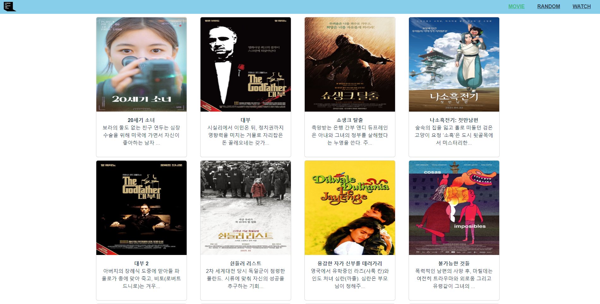
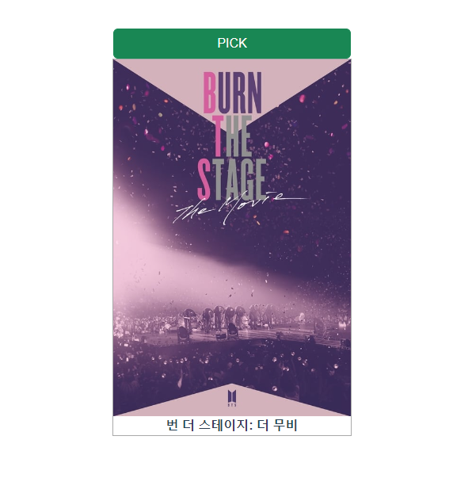

## 배중권

---

혼자 프로그래밍 하는것 보다 같이 하는것이 더욱 수월하다는 것을 오늘 페어프로그래밍을 통해 알게되었다. 시작할 때 설계하는 부분에서 충분히 고민 했기때문에 프로젝트를 진행하며 큰 어려움은 없었고, 확실하게 학습할수 있었다.

---

#### MOVIE 구현

- 라우터 링크를 이용하여 데이터를 주고 받는 부분을 확실하게 학습할 수 있었고, data를 이용하면 최초 한번만 데이터를 return해준다는 점을 알게됐다. 때문에 필요한 상황에 맞춰 data나 computed를 적절히 활용해야겠다고 생각했다.

---

#### RANDOM 구현

- lodash를 이용하여 랜덤숫자를 추출하고 추출한 숫자를 이용해 인덱스를 붙여주면서 추출했다. 이런 알고리즘적 요소를 사용하며 문제를 해결해나가는 부분이 재밌었다.

---

#### WATCH 구현

- div사이즈를 알맞게 맞추는데 고생을 좀 했다. 다행히 동료와 소통하며 잘 해결할 수 있었다. 폼을 만들어서 state로 데이터를 보내 state에 있는 데이터를 추출해서 사용하는 부분의 개념이 확실하게 잡혔다. (dispatch, commit)

---

## 백지원

---

### 구현 과정 중 학습한 내용

- 영화 정보를 제공하는 SPA 제작

- API 활용한 홈페이지 제작

- AJAX 통신과 JSON 구조에 대한 이해

- Vue CLI, Vue Router 플러그인 활용

## 어려웠던 부분

- AJAX통신을 통해 JSON data를 받아오는 부분
- CSS,HTML,BootStrap을 적절히 활용해 홈페이지를 디자인 하는 부분
- 페어 프로그래밍

## 새로 배운 것들

- BootStrap의 Flex container를 활용하는 방법

## 느낀 점

- 직접 서버와 데이터를 주고 받으며 웹 서비스의 데이터 구성을 이해할 수 있어 좋았음.

- AJAX통신을 통해 데이터를 받아 활용할 수 있어 좋았음
