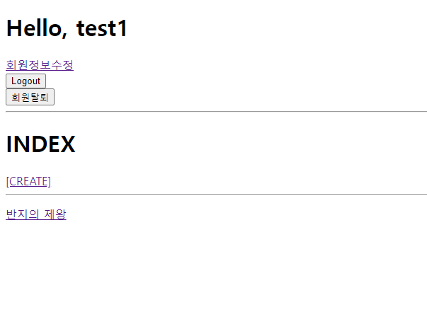
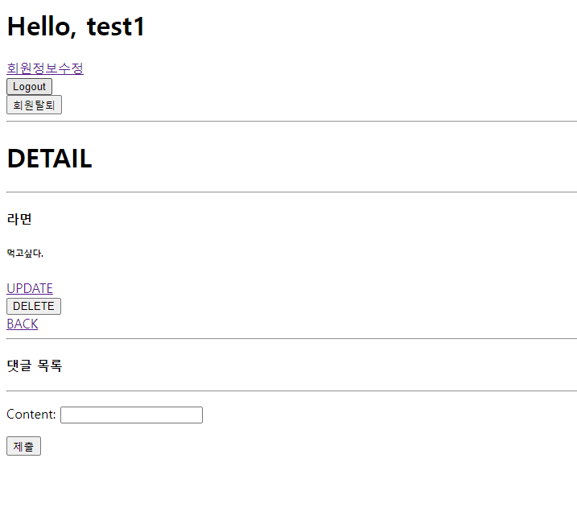
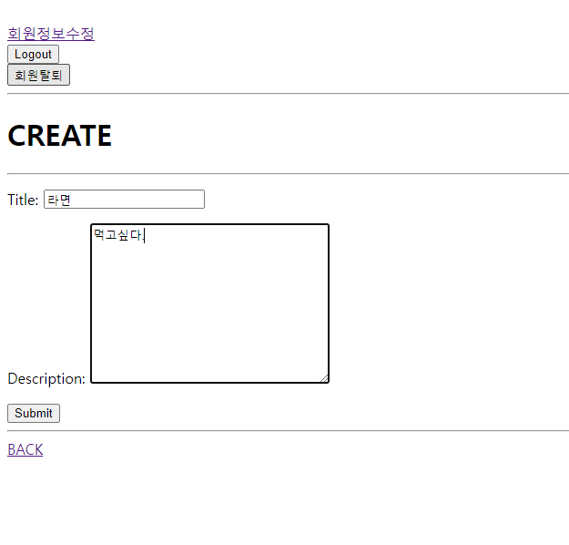
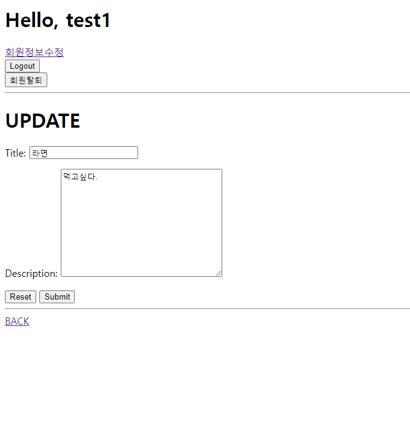
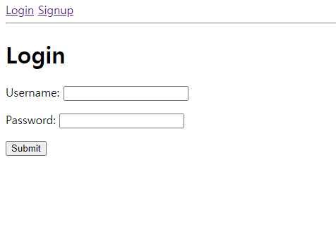
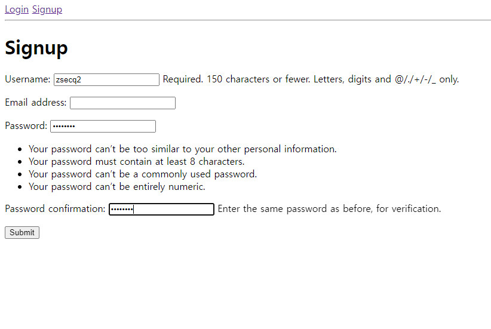
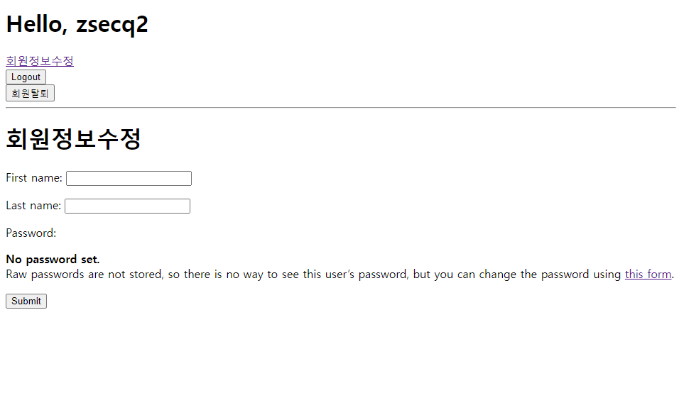
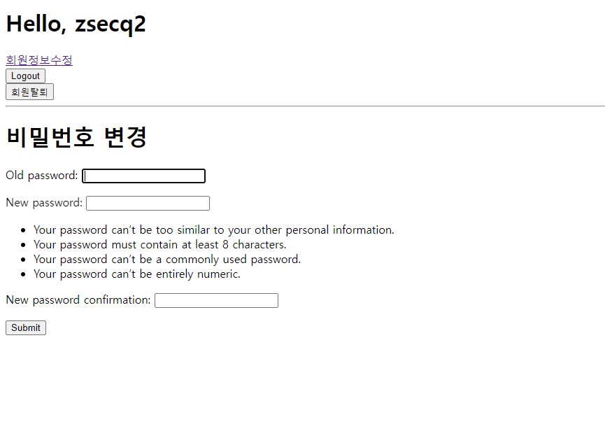

# 06_pjt_README

###### 짧은시간에 집중해서 구현했다.  기억이 안나거나 잘 모르겠던 부분들은 전에 했던 프로젝트를 참고하여 작성했는데 기억이 안나는 부분이 많았다. 그날 했던 수업들을 md파일로 하나하나 기록하고 복습하는 습관을 들여야 겠다고 생각했다.

---

1. index 구현

```python
def index(request):
    movies = Movie.objects.all()
    context = {
        'movies': movies
    }
    return render(request, 'movies/index.html', context)
```

```html



  <h1>INDEX</h1>
  <a href="" >[CREATE]</a>
  <hr>
  
    <p><a href="">{{ movie.title }}</a></p>
  


```



---

2. detail 구현

```python
def detail(request, pk):
    movie = get_object_or_404(Movie, pk=pk)
    comment_form = CommentForm()
    comments = movie.comment_set.all()
    context = {
        "movie": movie,
        "comment_form": comment_form,
        "comments": comments,
    }
    return render(request, "movies/detail.html", context)
```

```html



  <h1>DETAIL</h1>
  <hr>
  
  <h4>{{ movie.title }}</h4>
  <h6>{{ movie.description }}</h6>

  <a href="">UPDATE</a>
  <form action="">
    <input type="submit" value="DELETE">
  </form>
  <a href="">BACK</a>
  <hr>
  <h4>댓글 목록</h4>
  
    <li>{{ comment.content }}</li>
  
  <hr>
  
    <form action="" method="POST">
      
      {{ comment_form.as_p }}<input type="submit">
    </form>
  


```



---

3. create 구현

```python
def create(request):
    if request.method == 'POST':
        form = MovieForm(request.POST)
        if form.is_valid():
            movie = form.save(commit=False)
            movie.user = request.user
            movie.save()
            return redirect('movies:detail', movie.pk)
    else:
        form = MovieForm()
    context = {
        'form': form
    }
    return render(request, 'movies/Create.html', context)
```

```html



  <h1>CREATE</h1>
  <hr>
  <form action="" method="POST">
    
    {{ form.as_p }}
    <input type="submit" value="Submit">
  </form>
  <hr>

  <a href="">BACK</a>


```



---

4. update 구현

```python
def update(request, pk):
    movie = get_object_or_404(Movie, pk=pk)
    if request.user == movie.user:
        if request.method == "POST":
            form = MovieForm(request.POST, instance=movie)
            if form.is_valid():
                form.save()
                return redirect("movies:detail", movie.pk)
        else:
            form = MovieForm(instance=movie)
    else:
        return redirect("movies:index")
    context = {
        "movie": movie,
        "form": form,
    }
    return render(request, "movies/update.html", context)
```

```html



  <h1>UPDATE</h1>
  <form action="" method="POST">
    
    {{ form.as_p }}
    <input type="reset" value="Reset">
    <input type="submit" value="Submit">
  </form>
  <hr>
  <a href="">BACK</a>

```



---

5. login, logout 구현

```python
def login(request):
    if request.user.is_authenticated:
        return redirect('movies:index')
    if request.method == 'POST':
        form = AuthenticationForm(request, request.POST)
        if form.is_valid():
            auth_login(request, form.get_user())
            return redirect(request.GET.get('next') or 'movies:index')
    else:
        form = AuthenticationForm()
    context = {
        'form': form,
    }
    return render(request, 'accounts/login.html', context)
```

```html



  <h1>Login</h1>
  <form action="" method="POST">
    
    {{ form.as_p }}
    <input type="submit" value="Submit">
  </form>


```

```python
def logout(request):
    if request.user.is_authenticated:
        auth_logout(request)
    return redirect('movies:index')
```



---

6. signup 구현

```python
def signup(request):
    if request.user.is_authenticated:
        return redirect('movies:index')

    if request.method == 'POST':
        form = CustomUserCreationForm(request.POST)
        if form.is_valid():
            user = form.save()
            auth_login(request, user)
            return redirect('movies:index')
    else:
        form = CustomUserCreationForm()
    context = {
        'form': form
    }
    return render(request, 'accounts/signup.html', context)
```

```html



  <h1>Signup</h1>
  <form action="" method="POST">
    
    {{ form.as_p }}
    <input type="submit" value="Submit">
  </form>

```



---

7. update 구현

```python
def update(request):
    if request.method == 'POST':
        form = CustomUserChangeForm(request.POST, instance=request.user)
        if form.is_valid():
            form.save()
            return redirect('movies:index')
    else:
        form = CustomUserChangeForm(instance=request.user)
    context = {
        'form': form,
    }
    return render(request, 'accounts/update.html', context)
```

```html



  <h1>회원정보수정</h1>
  <form action="" method="POST">
    
    {{ form.as_p }}
    <input type="submit" value="Submit">
  </form>

```



---

8. change_password 구현

```python
def change_password(request):
    if request.method == 'POST':
        form = PasswordChangeForm(request.user, request.POST)
        if form.is_valid():
            form.save()
            update_session_auth_hash(request, form.user)
            return redirect('movies:index')
    else:
        form = PasswordChangeForm(request.user)
    context = {
        'form': form,
    }
    return render(request, 'accounts/change_password.html', context)
```

```html



  <h1>비밀번호 변경</h1>
  <form action="" method="POST">
    
    {{ form.as_p }}
    <input type="submit" value="Submit">
  </form>

```



---
