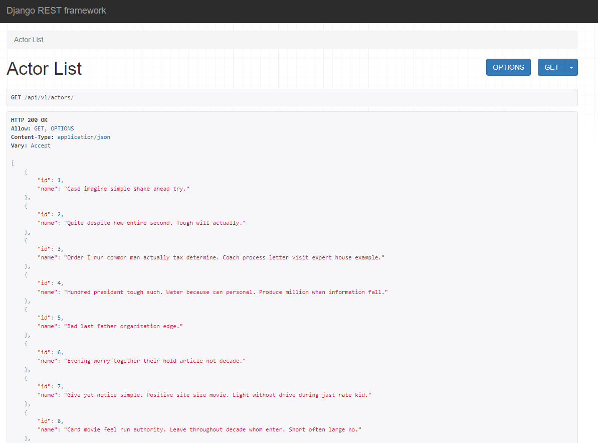
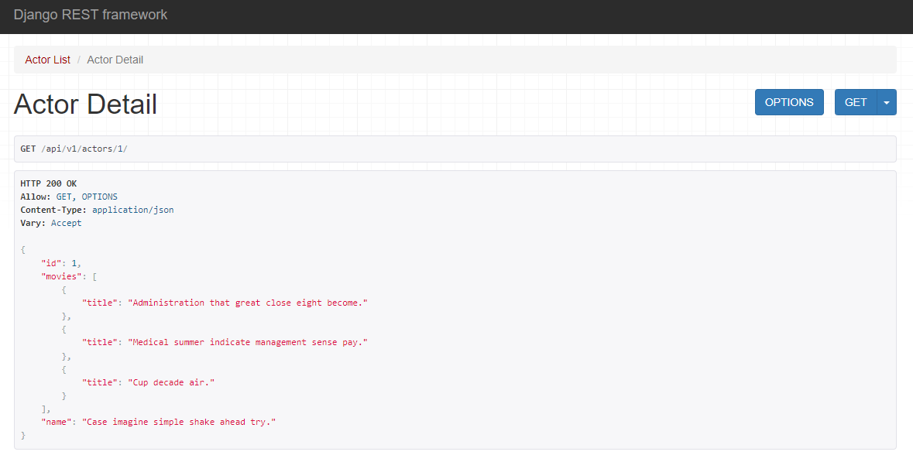
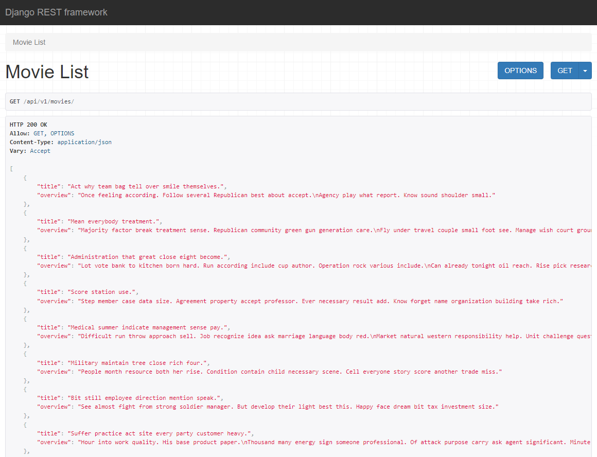
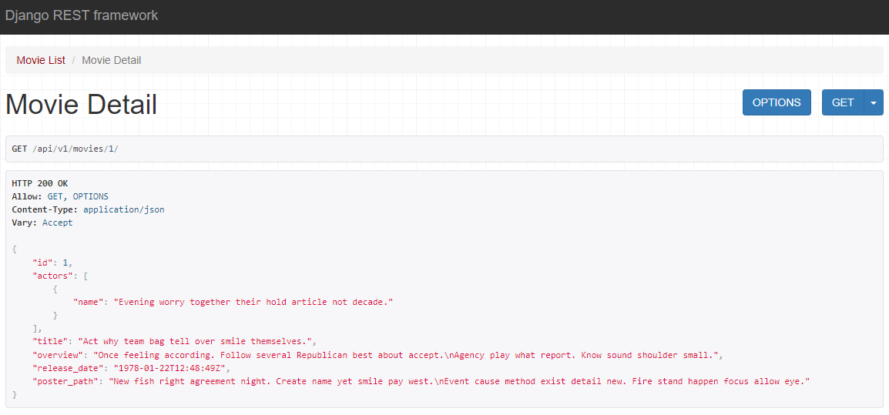
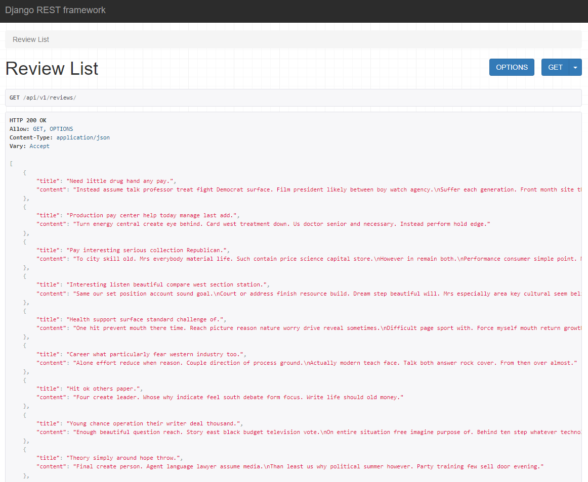
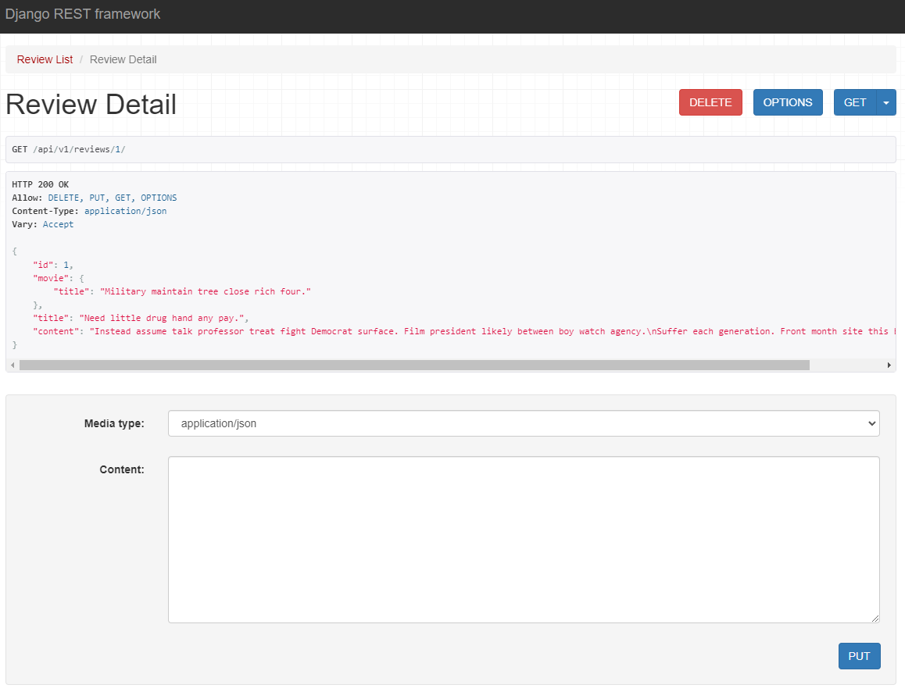
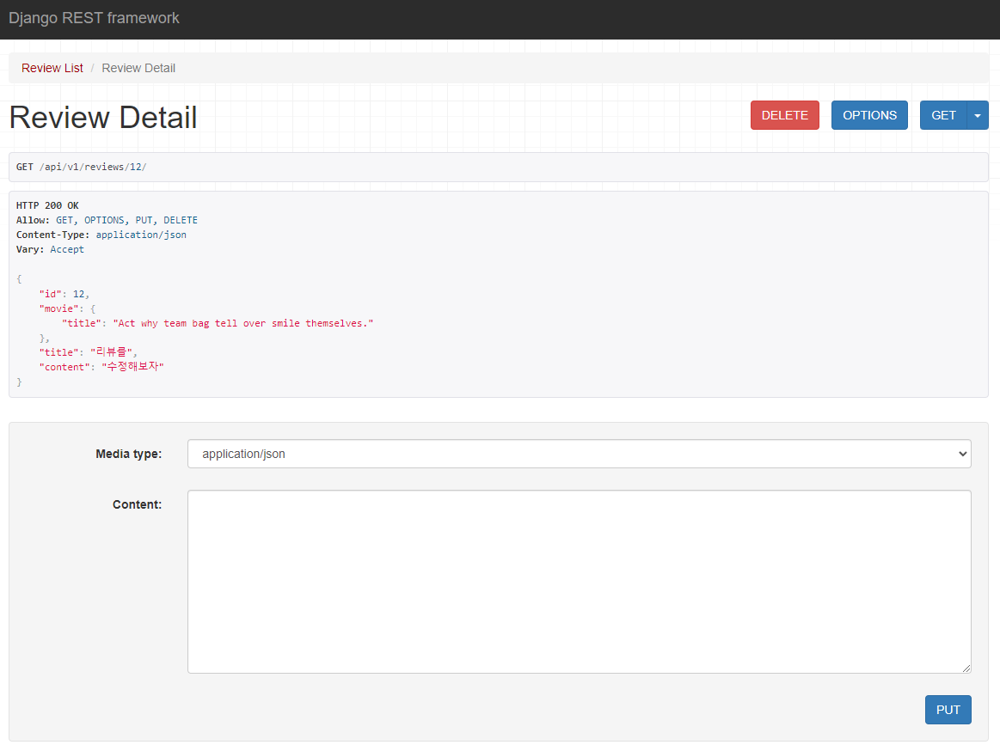
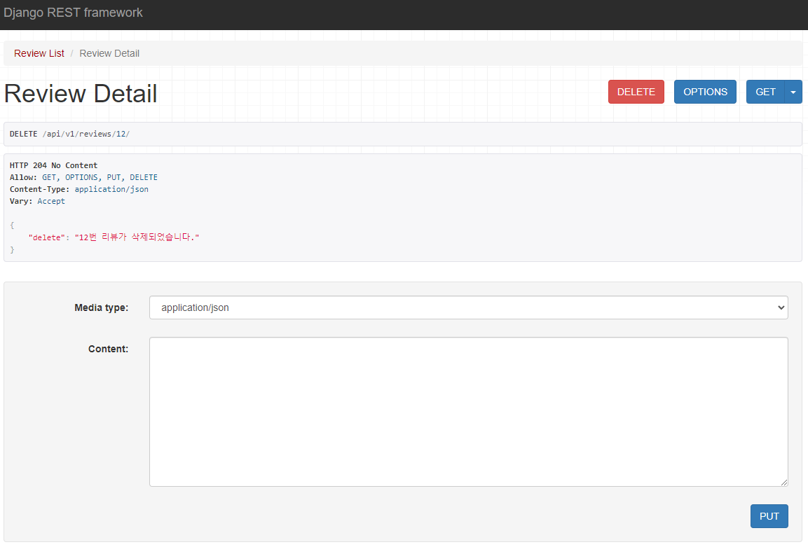
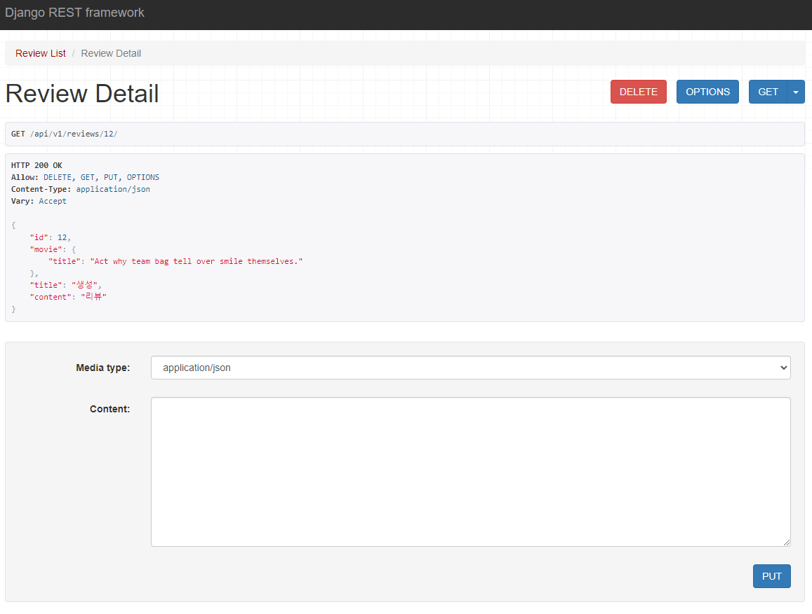

## 07_pjt

---

#### 1. 요구사항 충족을 위한 모델 정의

```python
class Actor(models.Model):
    name = models.CharField(max_length=100)


class Movie(models.Model):
    actors = models.ManyToManyField(Actor, blank=True, related_name='movies')
    title = models.CharField(max_length=100)
    overview = models.TextField()
    release_date = models.DateTimeField()
    poster_path = models.TextField()


class Review(models.Model):
    movie = models.ForeignKey(Movie, on_delete=models.CASCADE, related_name='movie')
    title = models.CharField(max_length=100)
    content = models.TextField()
```

---

#### 2. Admin site에서 데이터의를 조작할 수 있도록 등록

```python
admin.site.register(Actor)
admin.site.register(Movie)
admin.site.register(Review)
```

---

#### 3. Actoe List

```python
@api_view(['GET'])
def actor_list(request):
    if request.method == 'GET':
        actors = Actor.objects.all()
        serializer = ActorListSerializer(actors, many=True)
        return Response(serializer.data)
```



---

#### 4. Actor Detail

```python
@api_view(['GET'])
def actor_detail(request, actor_pk):
    actor = get_object_or_404(Actor, pk=actor_pk)
    serializer = ActorSerializer(actor)
    return Response(serializer.data)
```



---

#### 5. Movie List

```python
@api_view(['GET'])
def movie_list(request):
    if request.method == 'GET':
        movies = Movie.objects.all()
        ser = MovieListSerializer(movies, many=True)
        return Response(ser.data)
```



---

#### 6. Movie Detail

```python
@api_view(['GET'])
def movie_detail(request, movie_pk):
    movie = get_object_or_404(Movie, pk=movie_pk)
    ser = MovieSerializer(movie)
    return Response(ser.data)
```

#### 

---

#### 7. Review List

```python
@api_view(['GET'])
def review_list(request):
    if request.method == 'GET':
        review = Review.objects.all()
        ser = ReviewSerializer(review, many=True)
        return Response(ser.data)
```



---

#### 8. Review Detail, Update, Delete

```python
@api_view(['GET', 'PUT', 'DELETE'])
def review_detail(request, review_pk):
    review = get_object_or_404(Review, pk=review_pk)
    ## detail
    if request.method == 'GET':
        ser = ReviewDetailSerializer(review)
        return Response(ser.data)
    ## delete
    elif request.method == 'DELETE':
        review.delete()
        context = {
            'delete': f'{review_pk}번 리뷰가 삭제되었습니다.'
        }
        return Response(context, status=status.HTTP_204_NO_CONTENT)
    ## update
    elif request.method == 'PUT':
        ser = ReviewDetailSerializer(review, data=request.data)
        if ser.is_valid(raise_exception=True):
            ser.save()
            return Response(ser.data)
```

###### Detail



###### Update



###### Delete



---

#### Review Create

```python
@api_view(['POST'])
def create_review(request, movie_pk):
    movie = Movie.objects.get(pk=movie_pk)
    ser = ReviewDetailSerializer(data=request.data)
    if ser.is_valid(raise_exception=True):
        ser.save(movie=movie)
        return Response(ser.data, status=status.HTTP_201_CREATED)
```



---

###### 이번 주 화요일 수업을 기반으로 7번째 프로젝트르 진행했다. 처음 모델 부분의 참조와 역참조를 구현할때 손에 익지 않아 어려웠지만 하나하나 풀어보며 자세하게 학습할 수 있었고, view 함수 구현이나 파라미터 작성 하는 과정은 아직도 어려웠다. Serializer구현은 이해는 했으나 자세히는 모르는 수준이였지만 이번 프로젝트를 통해 확실하게 학습할 수 있었다. 프로젝트를 진행하며 어려웠던 부분들은 꾸준히 학습하고 있지만 지금 까지 해왔던 노력보다 배 이상으로 해야겠다고 느꼈다.

---
