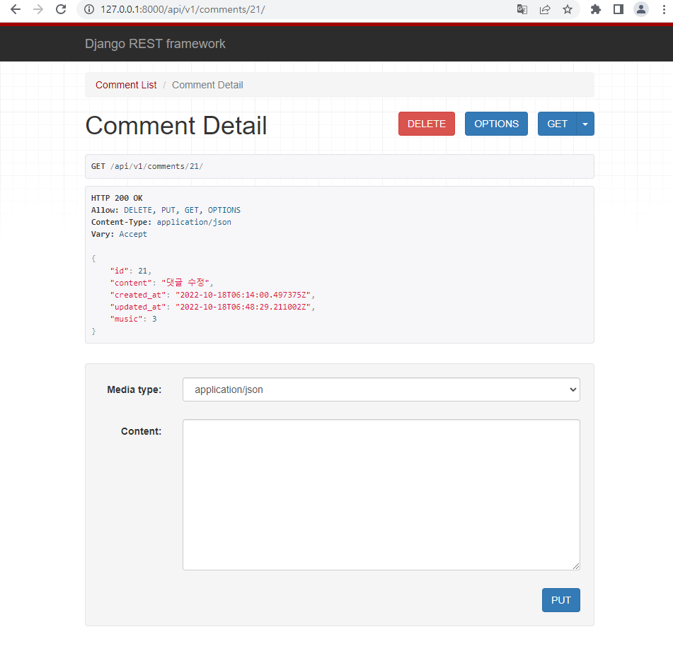
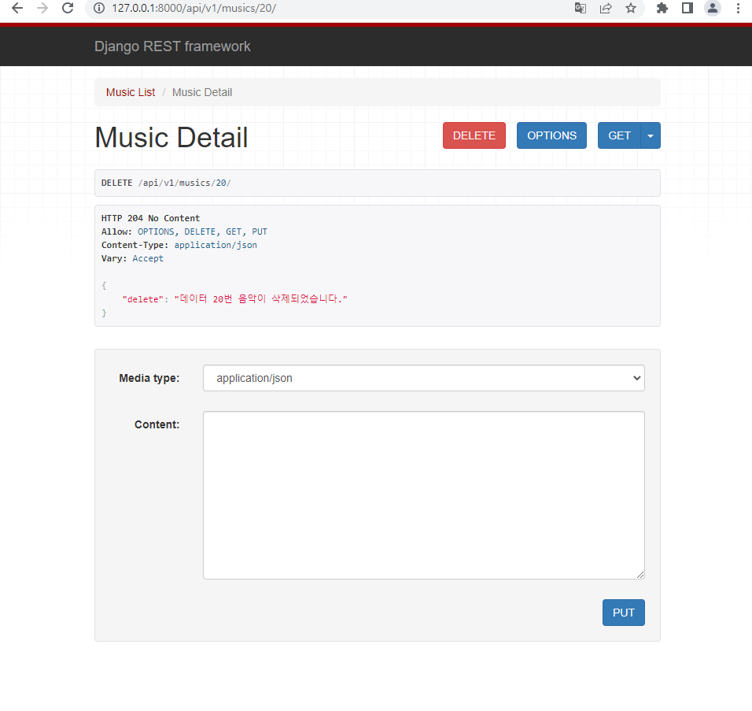
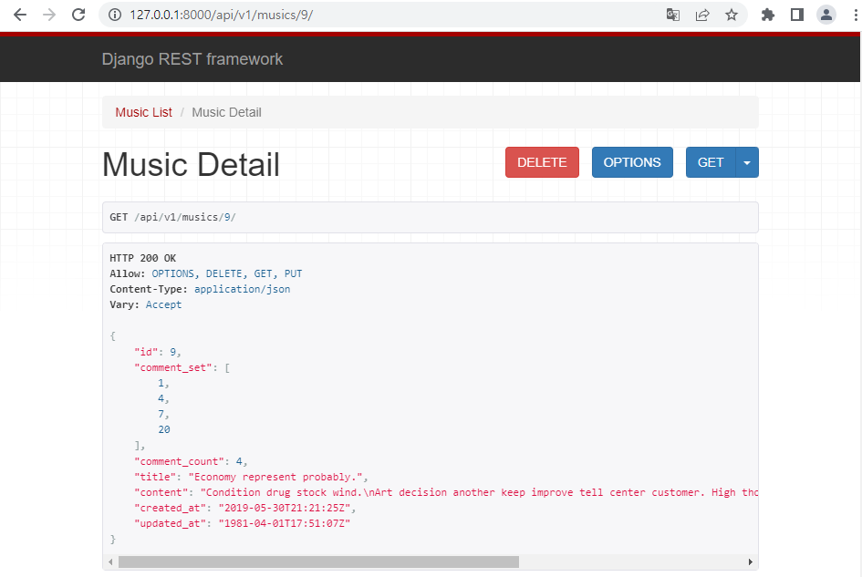

## 8_4

---

#### 1. 수정, 삭제 구현

```python
@api_view(['GET', 'DELETE', 'PUT'])
def comment_detail(request, comment_pk):
    comment = Comment.objects.get(pk=comment_pk)
    if request.method == 'GET':
        serializer = CommentSerializer(comment)
        return Response(serializer.data)
    
    elif request.method == 'DELETE':
        comment.delete()
        context = {
            'delete': f'댓글 {comment_pk}번이 삭제되었습니다.'
        }
        return Response(context, status=status.HTTP_204_NO_CONTENT)

    elif request.method == 'PUT':
        serializer = CommentSerializer(comment, data=request.data)
        if serializer.is_valid(raise_exception=True):
            serializer.save()
            return Response(serializer.data)
```






---

#### 2. music에서 댓글 정보를 조회할 수 있도록 재구성

- serializer

```python
class MusicSerializer(serializers.ModelSerializer):
    comment_set = serializers.PrimaryKeyRelatedField(many=True, read_only=True)
    comment_count = serializers.IntegerField(source='comment_set.count', read_only=True)

    class Meta:
        model = Music
        fields = "__all__"

```



---


