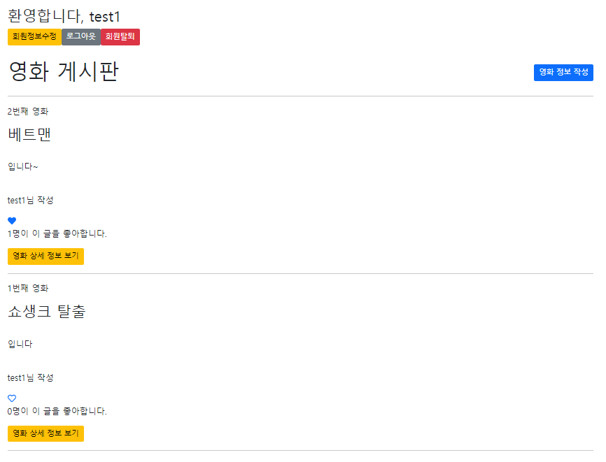

1. 좋아요 로직 구현을 like_users 정의

```python
like_users = models.ManyToManyField(settings.AUTH_USER_MODEL, related_name="like_movies")
```

---

2. 경로 작성

```python
path('<int:movie_pk>/likes/', views.likes, name='likes'),
```

---

3. 함수 작성

```python
def likes(request, movie_pk):
    # 로그인이 안된 사용자는 로그인 페이지로 redirect
    if request.user.is_authenticated:
        movie = get_object_or_404(Movie, pk=movie_pk)
        if movie.like_users.filter(pk=request.user.pk).exists():
            movie.like_users.remove(request.user)
        else:
            movie.like_users.add(request.user)
        return redirect('movies:index')
    return redirect('accounts:login')
```

---

4. 좋아요와 취수 로직을 하트모양으로 변경, 좋아요를 누른 유저의 수를 보여주는 로직 구현

```python
<div>
      <a href="" method="POST">
        
          <i class="fas fa-heart"></i>
        
          <i class="far fa-heart"></i>
        
      </a>
</div>
<p>{{ movie.like_users.all|length }}명이 이 글을 좋아합니다.</p>
```



---


