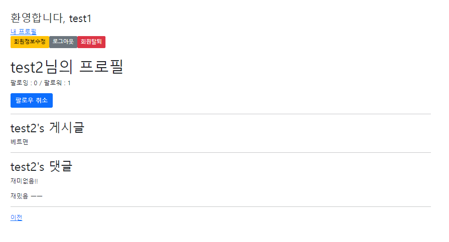
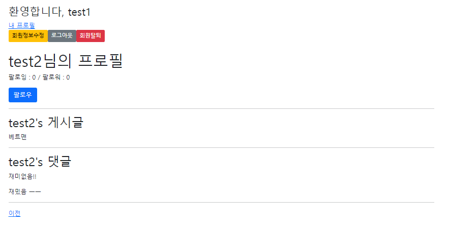

1. 프로필 url 경로

```python
path('profile/<username>/', views.profile, name='profile')
```

---

2. 프로필 함수

```python
def profile(request, username):
    User = get_user_model()
    person = User.objects.get(username=username)
    context = {
        'person': person
    }
    return render(request, 'accounts/profile.html', context)
```

---

3. base.html 확장

```python
<a href="">내 프로필</a>
```

---

4. 팔로우 로직 구현

```python
followings = models.ManyToManyField('self', symmetrical=False, related_name='followers')
```

---

5. 팔로우 url 경로

```python
path('<int:user_pk>/follow/', views.follow, name='follow')
```

---

6. 팔로우 함수

```python
def follow(request, user_pk):
    if request.user.is_authenticated:
        User = get_user_model()
        person = User.objects.get(pk=user_pk)
        if person != request.user:
            if person.followers.filter(pk=request.user.pk).exists():
                person.followers.remove(request.user)
            else:
                person.followers.add(request.user)
        return redirect('accounts:profile', person.username)
    return redirect('accounts:login')
```

---



---


