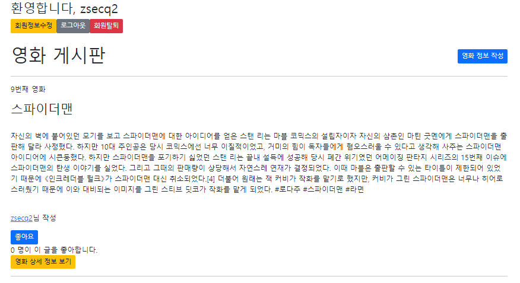
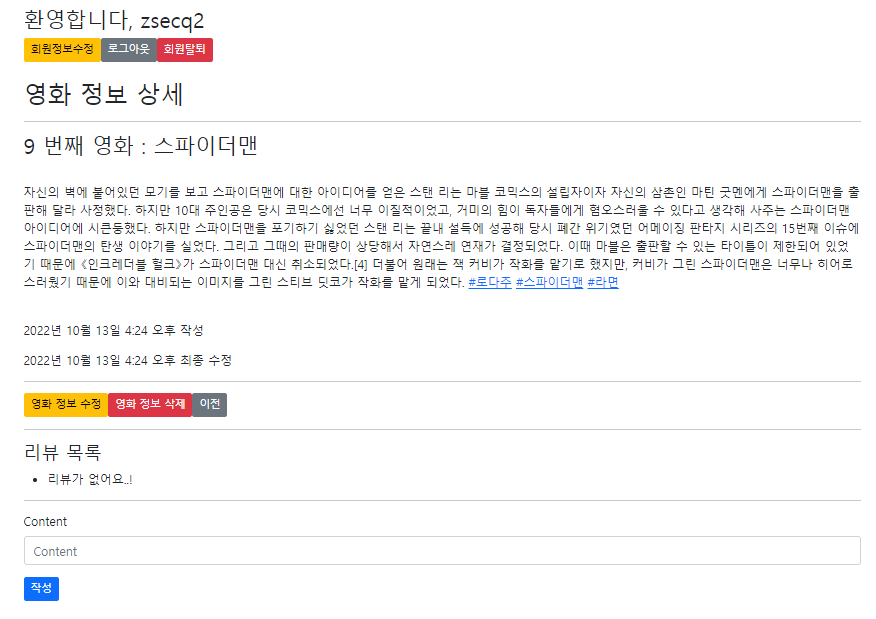
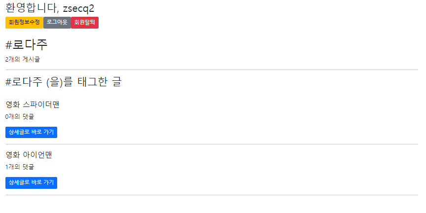

1. 해시태그 로직 수현

```python
class Hashtag(models.Model):
    content = models.TextField(unique=True)

class Movie(models.Model):
    hashtags = models.ManyToManyField(Hashtag, blank=True)
```

---

2. 해시태그 url 경로

```python
path("<int:hash_pk>/hashtag/", views.hashtag, name='hashtag')
```

---

3. 해시태그 함수, create 함수

```python
def hashtag(request, hash_pk):
    hashtag = get_object_or_404(Hashtag, pk=hash_pk)
    movies = hashtag.movie_set.order_by('-pk')
    context = {
        'hashtag': hashtag,
        'movies': movies,
    }
    return render(request, 'movies/hashtag.html', context)
```

```python
for word in movie.content.split():
     if word.startswith('#'):
        hashtag, created = Hashtag.objects.get_or_create(content=word)
        movie.hashtags.add(hashtag)
```

---

4. 링크 연결 로직 구현

```python
#movies/templatetags/make_link.py

from django import template

register = template.Library()

@register.filter
def hashtag_link(word):
    content = word.content + ' '
    hashtags = word.hashtags.all()
    for hashtag in hashtags:
        content = content.replace(hashtag.content + ' ', f'<a href="/movies/{hashtag.pk}/hashtag/">{hashtag.content}</a> ')
    return content
```

---

5. detail.html에 {{ movie|hashtag_link|safe }} 추가.

6. hashtag.html 작성

```python



  <div>
    <h2>{{ hashtag.content }}</h2>
    <p>{{ movies|length }}개의 게시글</p>
  </div>
  <hr>

  <div>
    <h3>{{ hashtag.content }} (을)를 태그한 글</h3>
    <br>
    
      <h5>영화 {{ movie.title }}</h5>
      <p>{{ movie.comment_set.all|length }}개의 댓글</p>
      <a href="" class="btn btn-primary btn-sm">상세글로 바로 가기</a>
      <hr>
    
  </div>

```

---



---



---



---


