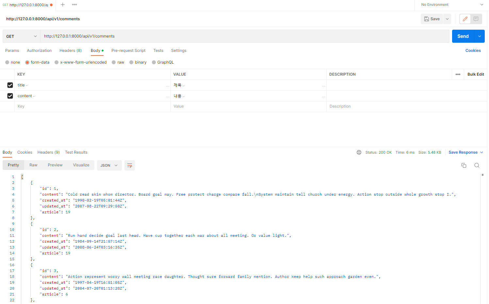
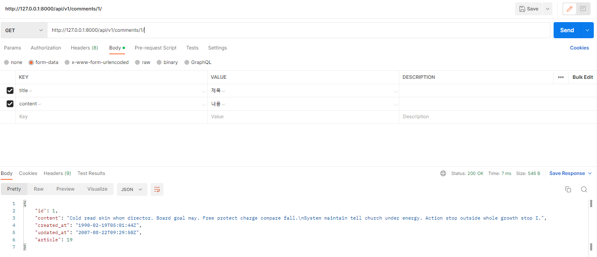
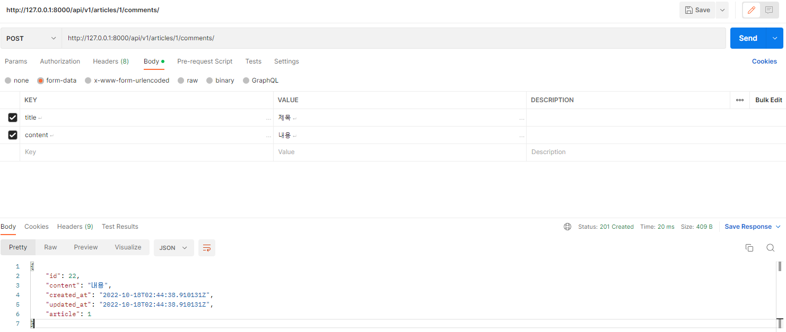

## 7_3

---

#### 1. serializers.py 정의

```python
class CommentSerializer(serializers.ModelSerializer):

    class Meta:
        model = Comment
        fields = '__all__'
        read_only_fields = ('article',)
```

---

#### 2. 댓글 조회 구현

```python
@api_view(['GET'])
def comment_list(requets):
    comments = get_list_or_404(Comment)
    serializer = CommentSerializer(comments, many=True)
    return Response(serializer.data)

```



---

#### 3. 상세 댓글 구현

```python
@api_view(['GET'])
def comment_detail(request, comment_pk):
    comment = Comment.objects.get(pk=comment_pk)
    serializer = CommentSerializer(comment)
    return Response(serializer.data)
```



---

#### 4. 댓글 생성 구현

```python
@api_view(['POST'])
def comment_create(request, article_pk):
    article = get_object_or_404(Article, pk=article_pk)
    serializer = CommentSerializer(data=request.data)
    if serializer.is_valid(raise_exception=True):
        serializer.save(article=article)
        return Response(serializer.data, status=status.HTTP_201_CREATED)
```



---


