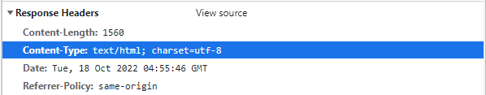
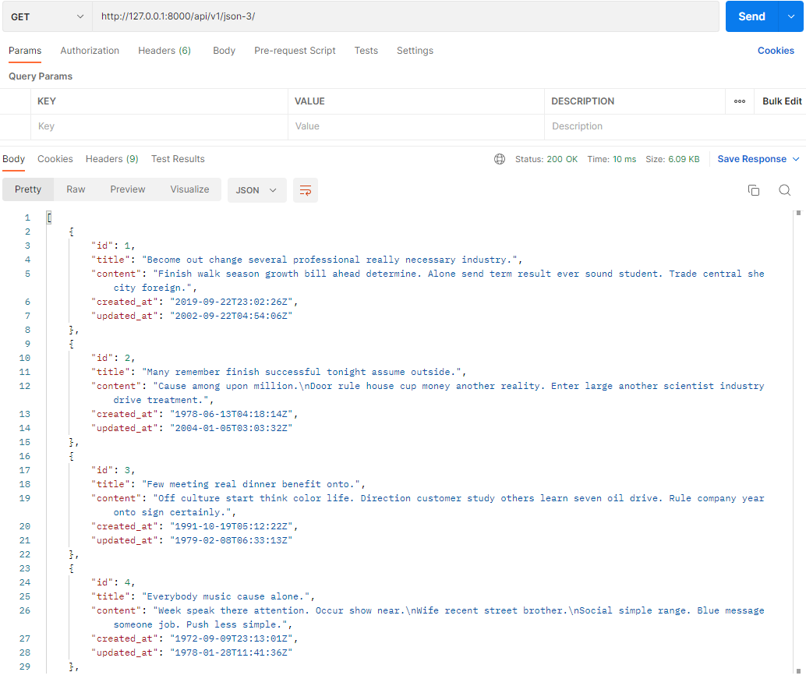

## 8_1

---

#### 1. HTML응답 확인



---

#### 2. json-3함수 구현 및 결과 확인

```python
@api_view()
def music_json_3(request):
    musics = Music.objects.all()
    serializer = MusicSerializer(musics, many=True)
    return Response(serializer.data)
```



---

#### 3. serializer 구현

```python
class MusicSerializer(serializers.ModelSerializer):

    class Meta:
        model = Music
        fields = '__all__'
```

---


