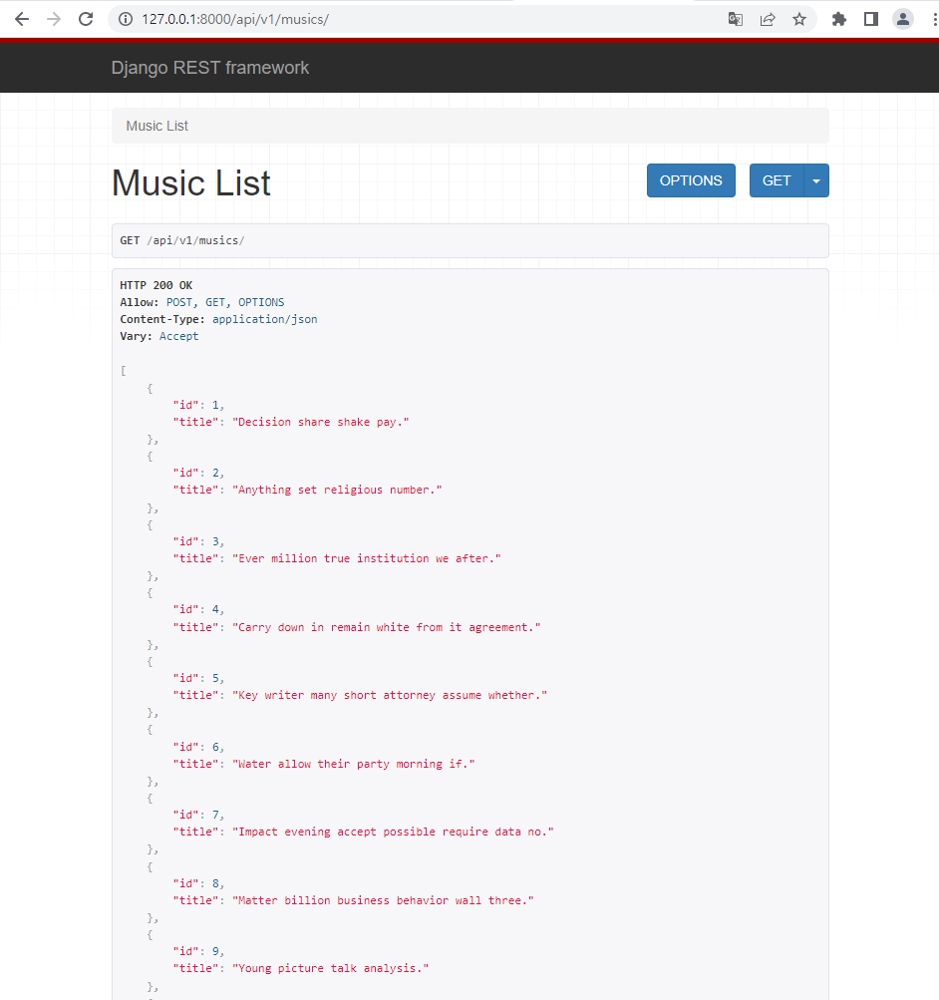
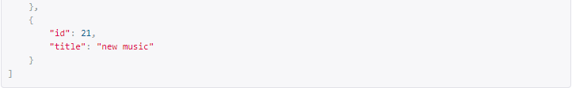
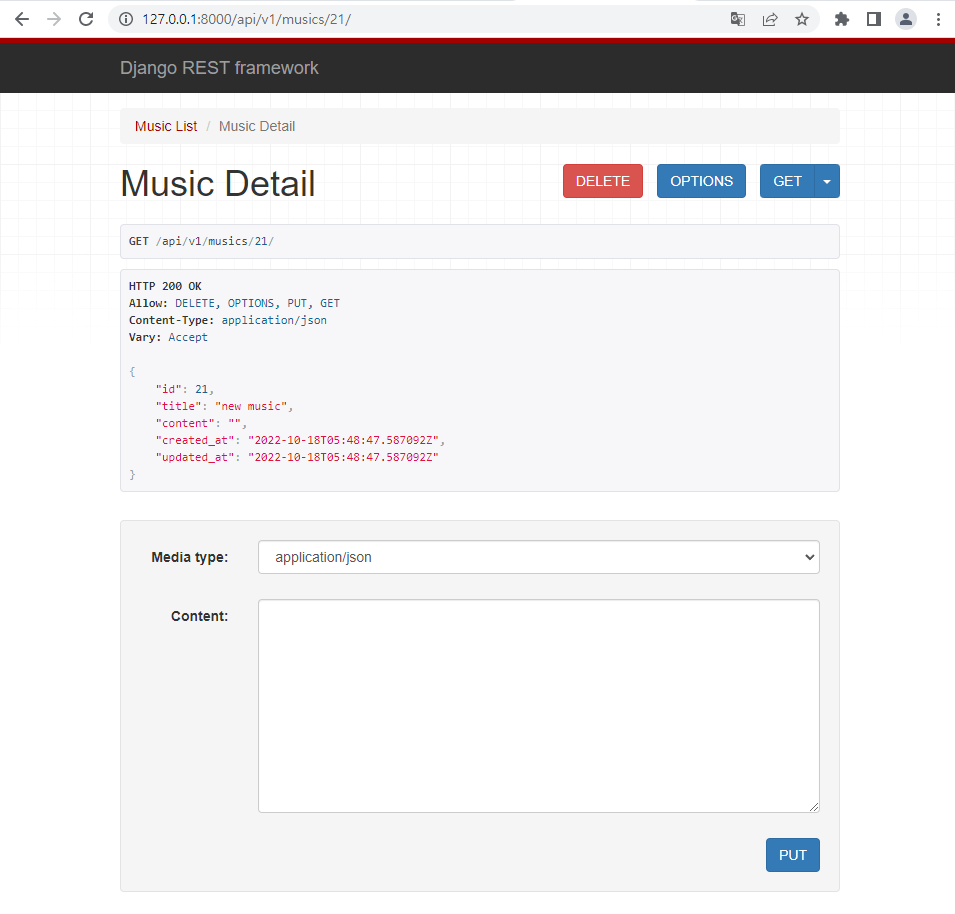
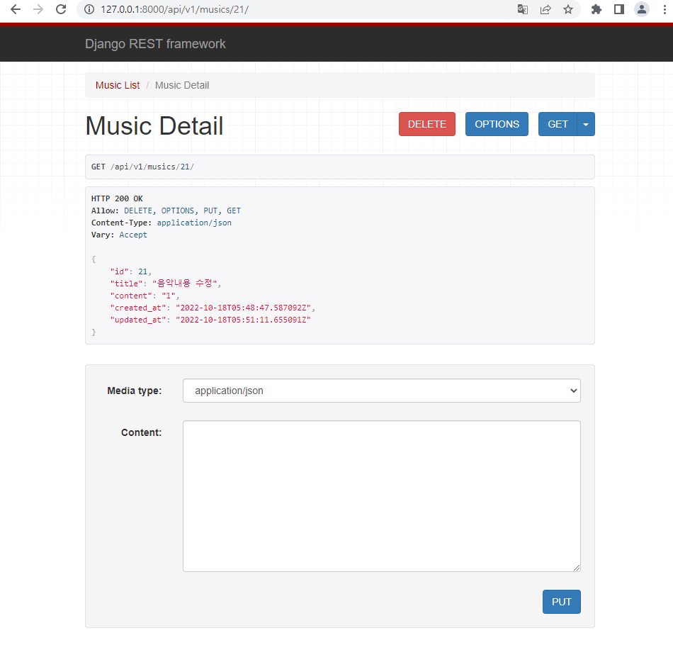
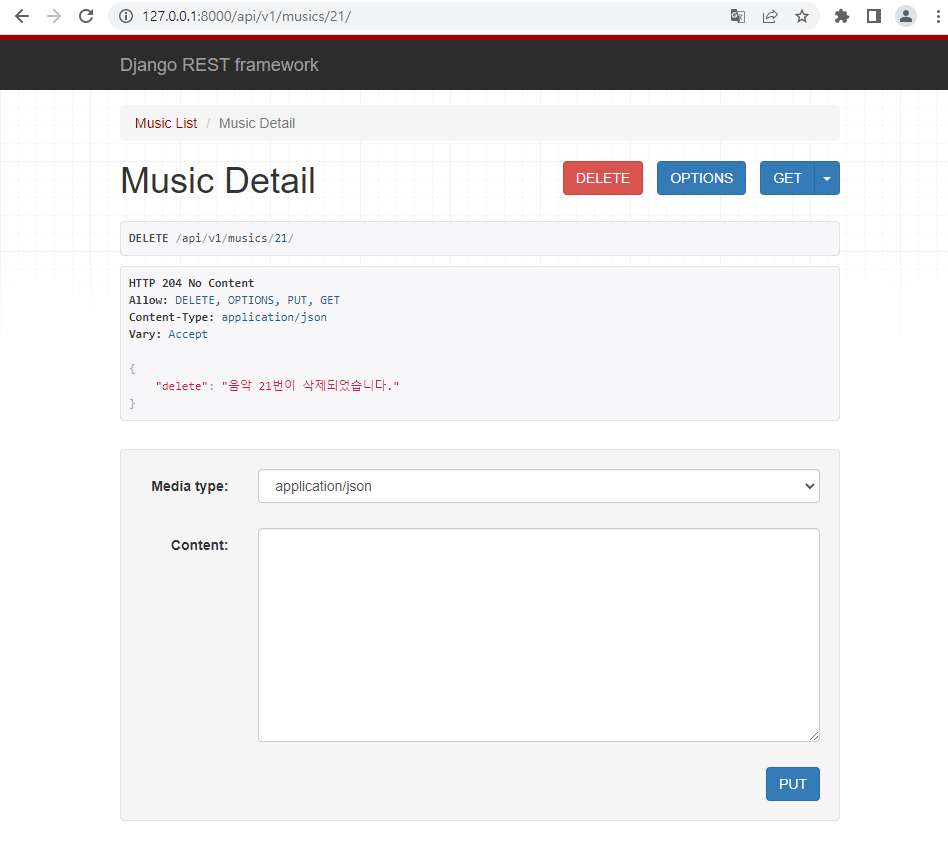

## 8_2

---

#### 1. serializer.py 정의

```python
class MusicListSerializer(serializers.ModelSerializer):

    class Meta:
        model = Music
        fields = ('id', 'title',)


class MusicSerializer(serializers.ModelSerializer):

    class Meta:
        model = Music
        fields = '__all__'
```

---

#### 2. 조회, 생성 구현

```python
@api_view(['GET', 'POST'])
def music_list(request):
    if request.method == 'GET':
        musics = get_list_or_404(Music)
        serializer = MusicListSerializer(musics, many=True)
        return Response(serializer.data)

    elif request.method == 'POST':
        serializer = MusicListSerializer(data=request.data)
        if serializer.is_valid(raise_exception=True):
            serializer.save()
            return Response(serializer.data, status=status.HTTP_201_CREATED)

```






---

#### 3. 조회, 수정, 삭제 구현

```python
@api_view(['GET', 'DELETE', 'PUT'])
def music_detail(request, music_pk):
    music = get_object_or_404(Music, pk=music_pk)
    if request.method == 'GET':
        serializer = MusicSerializer(music)
        return Response(serializer.data)
    
    elif request.method == 'DELETE':
        music.delete()
        data = {
            'delete': f'음악 {music_pk}번이 삭제되었습니다.'
        }
        return Response(data, status=status.HTTP_204_NO_CONTENT)

    elif request.method == 'PUT':
        serializer = MusicSerializer(music, data=request.data)
        if serializer.is_valid(raise_exception=True):
            serializer.save()
            return Response(serializer.data)
```








---


